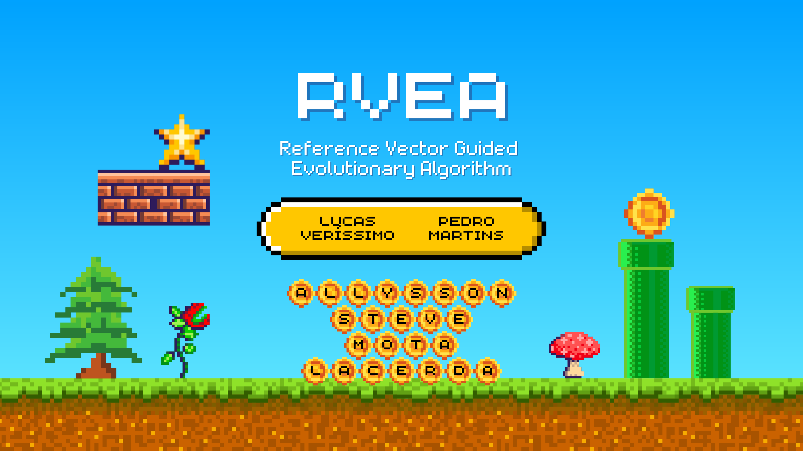
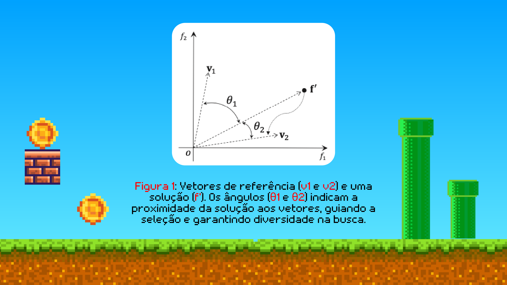
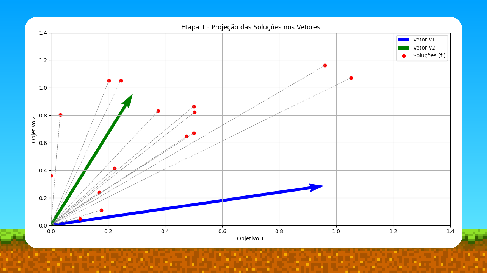
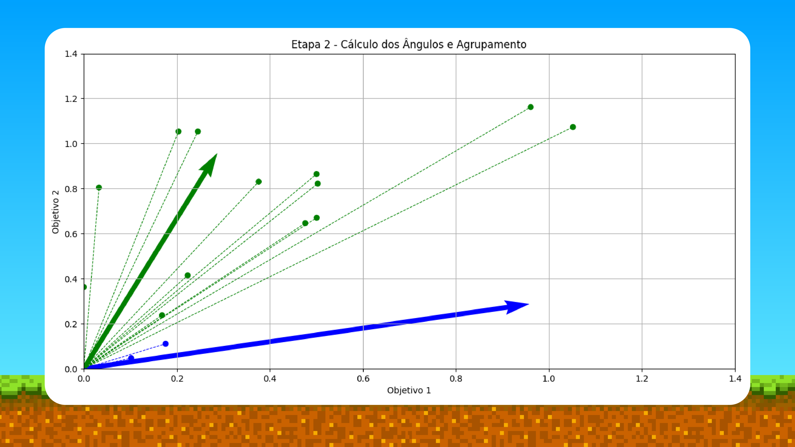
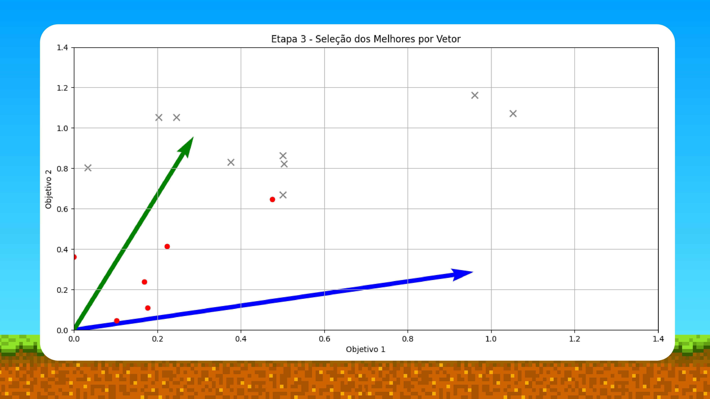
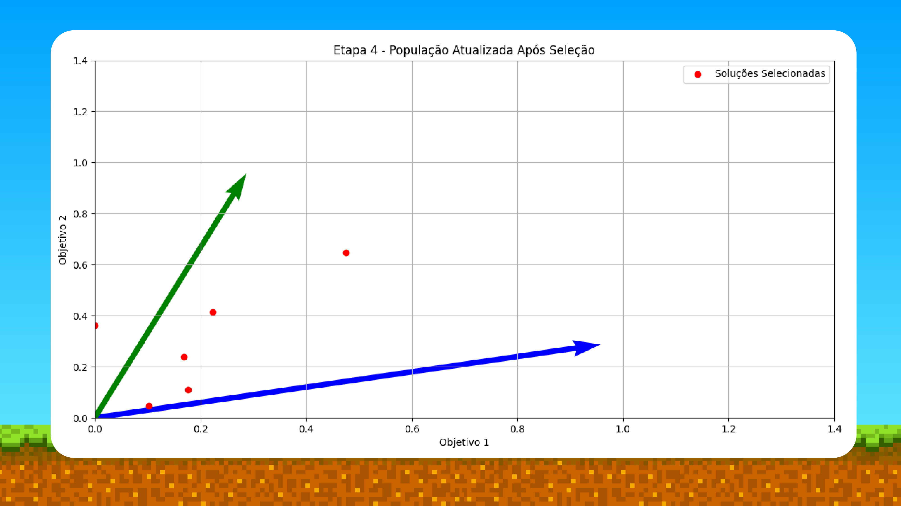

# RVEA Presentation / Apresentação RVEA

> **Repository Description / Descrição do Repositório:**
> Presentation on the Reference Vector Guided Evolutionary Algorithm (RVEA) for Many-Objective Optimization, including theoretical concepts, vector guidance mechanics, advantages, practical applications, and limitations.
>
> Apresentação sobre o Algoritmo Evolutivo Guiado por Vetores de Referência (RVEA) para Otimização Multi-Objetivo, incluindo conceitos teóricos, mecanismos de direcionamento por vetores, vantagens, aplicações práticas e limitações.

---

## 🇬🇧 English Version

### About the Project
This repository contains a presentation deck on the **Reference Vector Guided Evolutionary Algorithm (RVEA)**, an evolutionary algorithm designed for multi-objective and many-objective optimization problems (MaOPs). RVEA balances convergence and diversity by dynamically partitioning the objective space using reference vectors and adapting them throughout the evolutionary generations.

### Key Topics Covered
- **What is RVEA?**: Definition of the Reference Vector Guided Evolutionary Algorithm and its core principles for multi-objective optimization.
- **Motivation**: Addressing the limitations of conventional evolutionary algorithms that focus heavily on convergence while sacrificing population diversity.
- **General Workflow**:
  1. Initial generation of reference vectors distributed uniformly in objective space.
  2. Selection based on scalarization projection of solutions onto reference vectors.
  3. Adaptive updating of reference vectors during evolution.
- **Key Advantages**:
  - Balanced trade-off between convergence and diversity.
  - Simple implementation compared to standard decomposition/Pareto methods.
  - Excellent scalability for problems with more than 3 objectives (>3 objectives).
  - Lower computational cost compared to algorithms like NSGA-III.
- **Practical Application**: Aircraft Design optimization (balancing wing weight, aerodynamic efficiency, and manufacturing cost).
- **Limitations & Challenges**: Dependency on reference vector specification, performance in highly dynamic environments, and complex non-linear conflicting objectives.

### Authors
- **Lucas Veríssimo**
- **Pedro Martins**
- **Allysson Steve Mota Lacerda**

### How to View the Presentation
1. **Repository Screenshots**: Browse the slide deck preview directly in the section below.
2. **PDF File**: Open `RVEA.pdf` using any standard PDF reader (Adobe Acrobat, Web Browser, Evince, Okular, etc.):
   ```bash
   # Linux (example)
   xdg-open RVEA.pdf
   ```

---

### Presentation Slides (Demonstration)

| Slide 1 | Slide 2 |
| :---: | :---: |
|  |  |

| Slide 3 | Slide 4 |
| :---: | :---: |
|  |  |

| Slide 5 | Slide 6 |
| :---: | :---: |
|  |  |

| Slide 7 | Slide 8 |
| :---: | :---: |
|  |  |

| Slide 9 | Slide 10 |
| :---: | :---: |
|  |  |

| Slide 11 | Slide 12 |
| :---: | :---: |
|  |  |

| Slide 13 | Slide 14 |
| :---: | :---: |
|  |  |

---

## 🇧🇷 Versão em Português

### Sobre o Projeto
Este repositório contém uma apresentação completa sobre o **Algoritmo Evolutivo Guiado por Vetores de Referência (RVEA - Reference Vector Guided Evolutionary Algorithm)**, um algoritmo evolutivo desenvolvido para problemas de otimização multi-objetivo e com muitos objetivos (MaOPs). O RVEA equilibra convergência e diversidade dividindo dinamicamente o espaço de objetivos com vetores de referência e adaptando-os ao longo das gerações evolutivas.

### Principais Tópicos Abordados
- **O que é RVEA?**: Definição do Algoritmo Evolutivo Guiado por Vetores de Referência e seus princípios fundamentais para otimização multi-objetivo.
- **Motivação**: Solução para algoritmos convencionais que focam excessivamente em convergência, ignorando a diversidade da população na fronteira de Pareto.
- **Funcionamento Geral**:
  1. Geração inicial de vetores de referência distribuídos uniformemente no espaço de objetivos.
  2. Seleção baseada na projeção das soluções nesses vetores.
  3. Atualização adaptativa dos vetores de referência durante o processo evolutivo.
- **Vantagens do RVEA**:
  - Balanceamento eficaz entre convergência e diversidade.
  - Simplicidade na implementação.
  - Excelente escalabilidade para problemas com múltiplos objetivos (>3).
  - Menor custo computacional em comparação com o NSGA-III.
- **Aplicações Práticas**: Exemplo de otimização no projeto de aeronaves (peso da asa, eficiência aerodinâmica e custo de produção).
- **Limitações e Desafios**: Dependência de boa definição dos vetores de referência, sensibilidade a problemas altamente dinâmicos e objetivos conflitantes fortemente não lineares.

### Autores
- **Lucas Veríssimo**
- **Pedro Martins**
- **Allysson Steve Mota Lacerda**

### Como Abrir a Apresentação
1. **Demonstração no README**: Visualize todos os slides diretamente na galeria de imagens acima.
2. **Arquivo PDF**: Abra o arquivo `RVEA.pdf` com qualquer leitor de PDF de sua preferência (navegador web, Adobe Reader, Evince, etc.):
   ```bash
   # No Linux
   xdg-open RVEA.pdf
   ```
